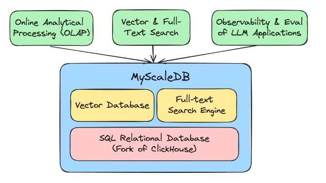
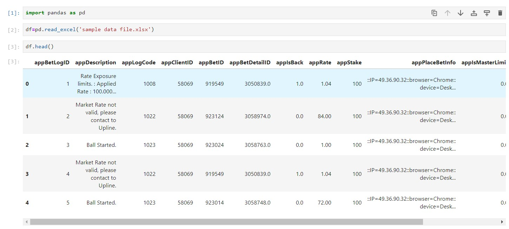
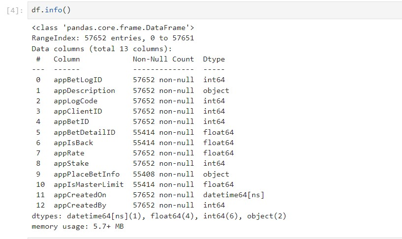
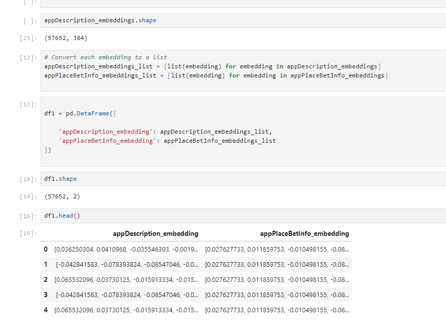
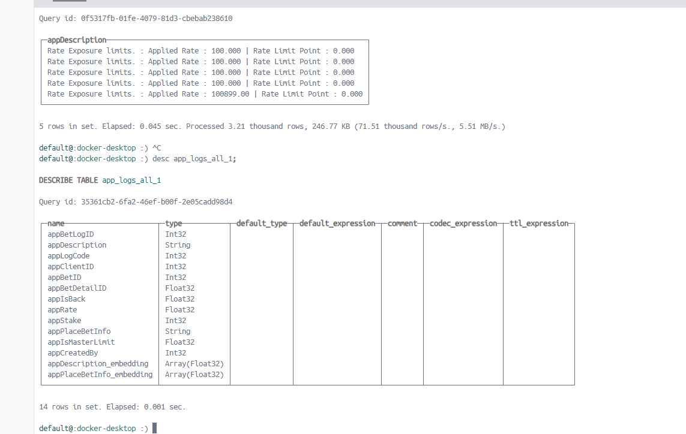
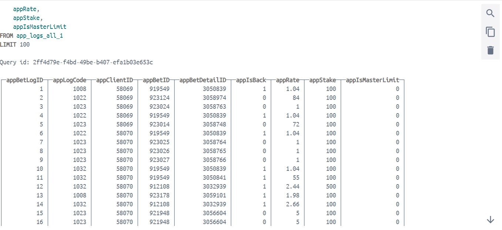
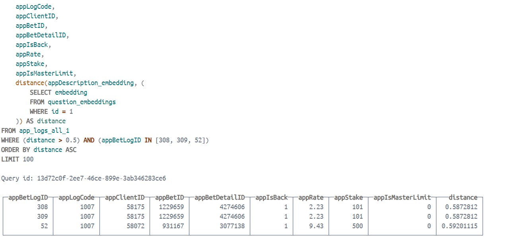
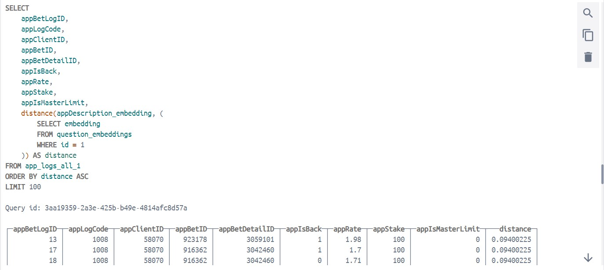
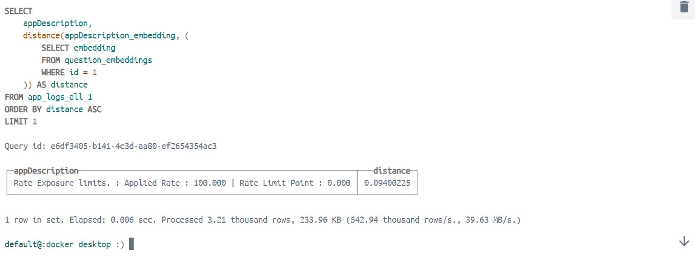

# Vector-SQL Database with MyScale DB 

## Introduction



Vector databases have gained significant popularity recently, primarily for their ability to store high-dimensional vector embeddings of unstructured data like text and images. These databases excel at performing semantic searches with impressive efficiency, making them superior to traditional relational databases for such use cases.

Long story short. They are better than traditional relational databases in this particular use case!

Recently I came across an interesting problem statement involving structured data, consisting of rows and columns with both numerical and categorical features. My challenge was to find an efficient way to store this data in a vector database and enhance query performance.

Through my research, I discovered an innovative solution: using a Vector-SQL Database. MyScale, an open-source database built on the robust ClickHouse, offers a compelling approach. ClickHouse, renowned for its columnar storage and fast querying capabilities, provides a stable and reliable foundation. MyScale extends this by enabling the storage of vector embeddings and supporting similarity searches.

What makes MyScale particularly impressive is its ability to handle these tasks using SQL queries. This feature allows for complex querying, unlocking a myriad of possibilities, and effectively combining the strengths of vector and relational databases. In essence, MyScale delivers the best of both worlds, offering enhanced query efficiency and powerful search capabilities.


Let me show the dataset I was dealing with:






# After Preprocessing the Data Frame Embeddings looks like this :



For creating the embeddings we have used a small model ('all-MiniLM-L6-v2') with the SentenceTransformer library.
Check out this 'myscaledb-DataPreprocessing.ipynb' file in the repo for more info.

I locally set up MyScale db on docker engine, and the results are phenomenal.

Here’s the GitHub repo for the MyScale DB: [MyScaleDB](https://github.com/myscale/MyScaleDB).

Here is my repo: [Vector-SQL-Database-Myscaledb](https://github.com/Harshitawake/Vector-SQL-Database-Myscaledb)

Feel free to look into this!

# Some handy SQL commands for setting up the Myscale db: 

# Create Table in Myscale db

```sql
CREATE TABLE app_logs_all_1 (
    `appBetLogID` INT,
    `appDescription` TEXT,
    `appLogCode` INT,
    `appClientID` INT,
    `appBetID` INT,
    `appBetDetailID` FLOAT,
    `appIsBack` FLOAT,
    `appRate` FLOAT,
    `appStake` INT,
    `appPlaceBetInfo` TEXT,
    `appIsMasterLimit` FLOAT,

    `appCreatedBy` INT,
    `appDescription_embedding` Array(Float32),
    `appPlaceBetInfo_embedding` Array(Float32),
    CONSTRAINT check_length CHECK length(appDescription_embedding) = 384,
    CONSTRAINT check_length CHECK length(appPlaceBetInfo_embedding) = 384
)
ENGINE = MergeTree
ORDER BY appBetLogID;
```

# Insert rows to the Table Created from the csv file saved in local

```sql
INSERT INTO app_logs_all_1 
SELECT
    toInt32(appBetLogID),
    appDescription,
    toInt32(appLogCode),
    toInt32(appClientID),
    toInt32(appBetID),
    toFloat32(appBetDetailID),
    toFloat32(appIsBack),
    toFloat32(appRate),
    toInt32(appStake),
    appPlaceBetInfo,
    toFloat32(appIsMasterLimit),

    toInt32(appCreatedBy),
    appDescription_embedding,
    appPlaceBetInfo_embedding

FROM file('/var/lib/clickhouse/user_files/outputfull1.csv', 'CSVWithNames');
```

# Create Vector index on embeddings columns

```sql
ALTER TABLE app_logs_all_1 ADD VECTOR INDEX vec_idx appDescription_embedding TYPE SCANN('metric_type=Cosine');
```
# Screen shots : 



# Create another table to store the query

```sql
CREATE TABLE question_embeddings (
    id Int32,
    question String,
    embedding Array(Float32),
    CONSTRAINT check_length CHECK length(embedding) = 384
)
ENGINE = MergeTree()
ORDER BY id;
```

# Insert the queries from csv file into the table

```sql
INSERT INTO question_embeddings
SELECT 
    id,
    question,
    embedding
FROM file('/var/lib/clickhouse/user_files/question.csv', 'CSVWithNames');
```

# Query command on your table

```sql
SELECT appBetLogID,
    appLogCode,
    appClientID,
    appBetID,
    appBetDetailID,
    appIsBack,
    appRate,
    appStake,
    appIsMasterLimit 
FROM app_logs_all_1 
LIMIT 100;
```
# Screen shots : 



# Query command on your table with similarity search and some condition

```sql
SELECT appBetLogID,
    appLogCode,
    appClientID,
    appBetID,
    appBetDetailID,
    appIsBack,
    appRate,
    appStake,
    appIsMasterLimit,
    distance(appDescription_embedding, (
        SELECT embedding
        FROM question_embeddings
        WHERE id = 1
    )) as distance
FROM app_logs_all_1
WHERE distance > 0.5 AND appBetLogID IN [308,309,52]
ORDER BY distance ASC
LIMIT 100;
```
# Screen shots : 


# Query command on your table with similarity search

```sql
SELECT appBetLogID,
    appLogCode,
    appClientID,
    appBetID,
    appBetDetailID,
    appIsBack,
    appRate,
    appStake,
    appIsMasterLimit,
    distance(appDescription_embedding, (
        SELECT embedding
        FROM question_embeddings
        WHERE id = 1
    )) as distance
FROM app_logs_all_1
ORDER BY distance ASC
LIMIT 100;
```
# Screen shots : 



# Query to find the closest description with distance

```sql
SELECT appDescription, distance(appDescription_embedding, (
    SELECT embedding
    FROM question_embeddings
    WHERE id = 1
)) as distance
FROM app_logs_all_1
ORDER BY distance ASC
LIMIT 1;
```
# Screen shots : 



## Credits

This project utilizes MyScale DB, an open-source database built on ClickHouse. MyScale leverages the stability and reliability of ClickHouse's columnar storage for faster querying while providing the capability to store vector embeddings and perform similarity searches. For more information, visit the MyScale DB repository: [MyScaleDB](https://github.com/myscale/MyScaleDB).

